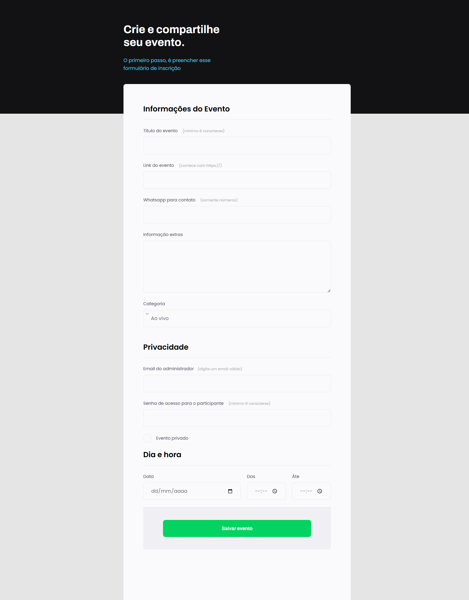

# Projeto 03-Explorer-Rocketseat

## 🚀 Tecnologias

Este projeto foi desenvolvido com as seguintes tecnologias:
- HTML
- CSS
- Figma

💻 Projeto
O Projeto-03 foi destinado a apresentar conceitos básicos de HTML e CSS. Nesse projeto, tive a oportunidade de aprimorar meus conhecimentos sobre:

formulários para capturar dados através da web;
tipos de input existentes no HTML (text, password, number e checkbox);
tipos de tags (select e text-area);
funcionamento de formulários no HTML (atributos action e method);
tipos de métodos que podem ser passados através de um formulário (GET e POST);
foi mostrado como funciona uma busca no Google (utilizando a tag para passar os inputs do tipo text, hidden e submit);
como devem ser utilizadas as tags HTML e ;
input do tipo url e number;
tag do HTML <textarea> e ajustes em questões de acessibilidade;
como estilizar o campo "select" através do CSS;
input do tipo email, password, date e time;
forma de personalizar um input do tipo checkbox no CSS;
lidar com posicionamento, utilizar pseudo-classes e trabalhar com acessibilidade;
inserir botão do tipo "submit" na página e personalizar de acordo com o layout do figma;
fazer a validação dos formulários que eram obrigatórios preencher com a propriedade "require" dentro dos inputs.